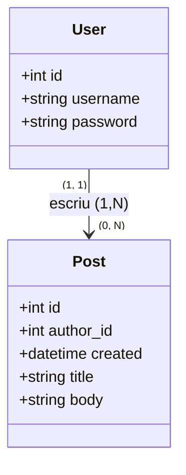

```mermaid
classDiagram
    class User {
        +int id
        +string username
        +string password
    }


    class Post {
        +int id
        +int author_id
        +datetime created
        +string title
        +string body
    }
    User "(1, 1)" --> "(0, N)" Post : escriu (1,N)
```